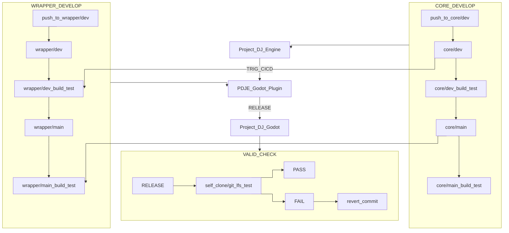

# Project_DJ_Godot

---
📢 Development Notice – Raw Input System Update

After extensive investigation, a conflict has been confirmed between the project’s custom Raw Input thread and Godot Engine’s internal DisplayServer Raw Input registration.
The root cause was a “ping-pong” ownership issue, where both systems repeatedly attempted to register control over the same input devices.

Although considerable time was spent exploring other potential causes, this discovery has clarified the problem.

✅ Resolution Plan:
The Raw Input handler will be migrated to a separate process, using IPC (Inter-Process Communication) for data exchange with the main application.
This approach follows the same design philosophy used in Linux, ensuring input isolation and preventing ownership conflicts.

Implementation of this new architecture will begin shortly.
---


---
**🔍 How To Use**

```bash
git clone https://github.com/Rliop913/Project_DJ_Godot.git
cd Project_DJ_Godot
cp Update_Project_DJ_Godot.bat ~/path/to/your/project/root
cp Update_Project_DJ_Godot.sh ~/path/to/your/project/root

cd  ~/path/to/your/project/root

bash ./Update_Project_DJ_Godot.sh


```

---


📦 **CI/CD Prebuilt Repository**  
This repository receives and stores prebuilt artifacts from [PDJE_Godot_Plugin](https://github.com/Rliop913/PDJE-Godot-Plugin) via automated GitHub Actions.

---


## 🔗 Related Projects
- 🪄 **Godot Wrapper**: [PDJE-Godot-Plugin](https://github.com/Rliop913/PDJE-Godot-Plugin)

- 🧱 **Core Library**: [Project-DJ-Engine](https://github.com/Rliop913/Project-DJ-Engine)

- 📚 **Documentation**: [PDJE DOCS](https://rliop913.github.io/Project-DJ-Engine)

---

## 🔁 CI/CD Call Graph




This is the CI/CD call graph for this project.
These three repositories are chained into one continuous automation flow using GitHub Actions.
