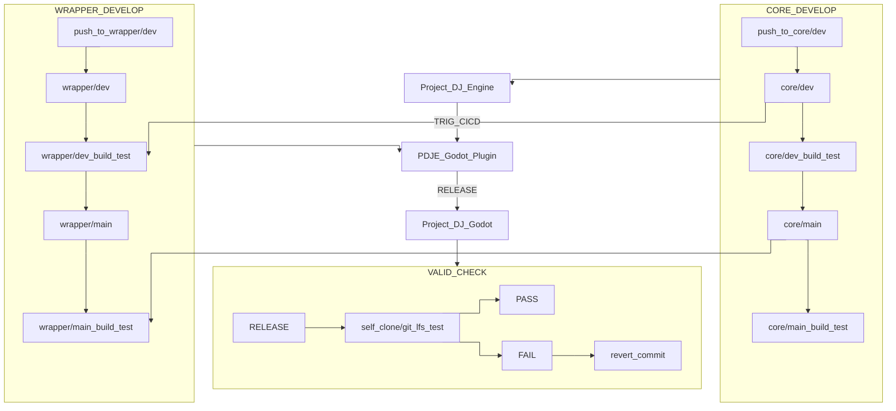

# Project_DJ_Godot

---

# Project DJ Godot — Update Notice (v0.7.X)

## Documents & Sources

- **[Official Documentation](https://rliop913.github.io/Project-DJ-Engine)**  
  General usage, API details, and examples for PDJE and Project DJ Godot are provided via the project repository (`README`, Wiki, and `docs/`).  
  Documentation for the **Judge module integration flow** and the **rhythm game template `.tscn` scene** will be added/updated alongside v0.7.X.

- **[AskToPDJE](https://github.com/Rliop913/AskToPDJE) (Code/Docs Q&A Helper)**  
  **AskToPDJE** is a RAG-based helper that answers questions about the PDJE / Project DJ Godot codebase and docs.  
  It is designed to help with questions such as:
  - “What does this node do?”
  - “Where does this configuration come from?”
  - “How do I extend the input/judge loop?”

  For setup and usage, please refer to the **AskToPDJE repository `README`**.

- **Community & Feedback ([Discord](https://discord.gg/2Pwju7xhmS) / GitHub Issues)**  
  A dedicated **Project DJ Engine Discord server** is available for:
  - Interface/API change proposals
  - Usability feedback and improvement requests
  - Questions about integrating PDJE / Project DJ Godot

  For more structured feature requests and bug reports, please open a **GitHub Issue**.  
  Feedback from Discord and GitHub Issues will be collected and prioritized together.

---

## Abstract

Project DJ Godot v0.7.X **officially adds support for the PDJE Judge Module**.  
With this update, you can connect **PDJE Core + Input + Judge** into a single flow inside a Godot scene, implementing the full loop:

> Input → Judgement → Feedback

primarily from Godot-side logic.

The PDJE / Project DJ Godot project is actively evolving its **interface API** based on user feedback.  
At the moment, **PDJE Input and Judge modules are supported on Windows first**.  
Support for **Linux → macOS** will be added next for both the Input / Judge modules and the Project DJ Godot integration layer.

> Note: The **PDJE Core module already supports Windows / Linux / macOS**.  
> Currently, only the **Input / Judge modules are Windows-first**, and the Godot integration is following that rollout.

A dedicated **Discord server** is available for interface/API feedback.  
Please use **Discord channels** or **GitHub Issues** to propose interface changes or report usability issues; these will be reviewed and prioritized over time.

---

## What Can We Do (New with Judge Module Support)

### Receive judgement results directly in Godot

- The Judge module computes judgement results and sends them into Godot via signals.  
- Example payload fields:
  - Lane / note identifier (which lane/note was judged)
  - Timing offset (early/late, offset value)

This lets you keep the timing/judgement logic in PDJE while handling visual and gameplay feedback in Godot.

---

### Build a chart-driven judgement loop

- The Judge module uses **chart data loaded into PDJE** to decide which note an input event should match.  
- On the Godot side, you only need to care about:
  - *When* a note was hit or missed
  - *Which* note or lane it belonged to  

This allows you to focus on effects, scoring, and combo logic rather than low-level matching.

---

### Separate feedback per lane / object

- Each lane node (or dedicated Judge node) can subscribe only to the judgement signals relevant to it.  
- This makes it easy to:
  - Play different effects per lane
  - Trigger lane-specific sounds or animations
  - Apply lane-dependent camera or background reactions

---

### Apply per-device / per-key judgement rules and offsets

- The Judge module interacts with the Core and Input modules, enabling:
  - Different judgement rules or offsets **per device / per key**

- Example usage:
  - Apply a specific judgement offset only to a particular device+key pair
  - Map multiple keyboards/controllers to separate lane groups and assign distinct judgement rules

This is especially useful for multi-controller setups or arcade-style input devices.

---

### Timeline-synchronized judgement-driven effects

- Judgement is computed in sync with the **PDJE timeline** (beat/frame-based).  
- You can use this to implement rhythm-game–specific behavior such as:
  - Triggering certain effects only on “on-time” hits
  - Driving camera/background reactions on misses
  - Aligning visual feedback with precise musical timing

---

### Rhythm-game starter template scene (`.tscn`)

- v0.7.X ships with a **template `.tscn` scene** that includes a simple rhythm game flow with the Judge module wired in.
- By duplicating and modifying this scene, you can quickly bootstrap a prototype that already has:
  - Input → Judgement → Feedback wired end-to-end

This template is intended as a starting point for building your own rhythm game on top of Project DJ Godot and PDJE.

---


---

# 📢 PDJE Input Module — Update Notice (v0.6.X)

## Abstract

The PDJE Input Module has been updated. This module is a **cross-platform, low-level input engine** provided by Project DJ Engine, delivering **best-in-class low latency** suitable for production deployments.
Input data is wrapped through Godot Engine **Signals**, exposing **device GUID**, **user-defined device name**, and **input timestamp (microseconds, µs)** within each signal payload.

---

## What Can We Do

* **Multi-device identification & separation**: Designed to distinguish input sources so that the **same key code** from **different keyboards** is handled independently.
* **High-resolution timestamps**: Uses OS-specific high-resolution timers to provide **µs-level** timestamps.
* **Flexible mapping**:

  * Example: Map **Keyboard A** to lane 1 and **Keyboard B** to lane 2.
  * Example: Connect **multiple mouse** simultaneously and assign **separate cursors** to each.
* **Godot Signal integration**: On each input event, a Signal is emitted with payload fields such as:

  * `device_id` (device unique identifier)
  * `device_name` (registered name)
  * `t_us` (event timestamp, µs)
  * `event_type`, `code`, `value` (implementation details)

> *Note:* Actual signal names/fields may vary by project configuration. Refer to the module’s API docs.

## Current Support / Version

* **PDJE Version:** `0.7.X`
* **Windows Backend:** **RawInput**
* **Linux (planned):** `libevdev + epoll + RT scheduling`
* **macOS (under review):** `IOKit (tentative)`

---

## Known Issues / Recommendations

* **Port collisions:** Very rare during initialization; if repeated, report with logs.
* **Security/AV tools:** Some environments may restrict RawInput or subprocess creation. Whitelisting/exceptions may be required.
* **Timebase alignment:** For µs-level judgments, follow the documentation’s **timebase synchronization** strategy with your audio/judging engine.

---


---
**🔍 How To Use**

```bash
git clone https://github.com/Rliop913/Project_DJ_Godot.git
cd Project_DJ_Godot
cp Update_Project_DJ_Godot.bat ~/path/to/your/project/root
cp Update_Project_DJ_Godot.sh ~/path/to/your/project/root

cd  ~/path/to/your/project/root

bash ./Update_Project_DJ_Godot.sh


```

---


📦 **CI/CD Prebuilt Repository**  
This repository receives and stores prebuilt artifacts from [PDJE_Godot_Plugin](https://github.com/Rliop913/PDJE-Godot-Plugin) via automated GitHub Actions.

---


## 🔗 Related Projects
- 🪄 **Godot Wrapper**: [PDJE-Godot-Plugin](https://github.com/Rliop913/PDJE-Godot-Plugin)

- 🧱 **Core Library**: [Project-DJ-Engine](https://github.com/Rliop913/Project-DJ-Engine)

- 📚 **Documentation**: [PDJE DOCS](https://rliop913.github.io/Project-DJ-Engine)

- 🤖 **Codebase Assistant**: [AskToPDJE](https://github.com/Rliop913/AskToPDJE)

- 💻 **Discord**: [Official Discord](https://discord.gg/2Pwju7xhmS)

---

## 🔁 CI/CD Call Graph




This is the CI/CD call graph for this project.
These three repositories are chained into one continuous automation flow using GitHub Actions.
