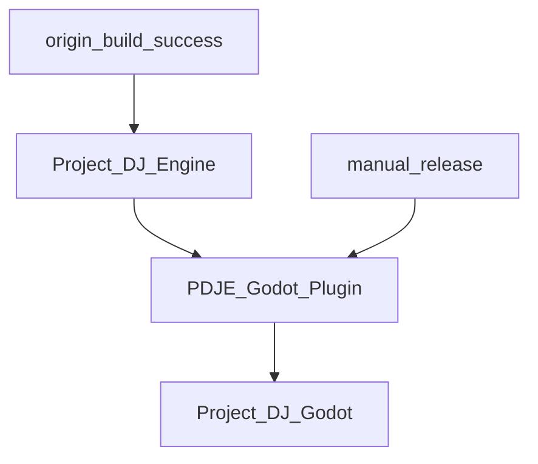

# Project_DJ_Godot

---

**notification: ~~lfs is stuck in traffic throttling. The domain will soon be changed from ngrok to cloudflare, and the update will be applied within 24 hours of notification.~~ **
**LFS FIXED**

---

📦 **CI/CD Prebuilt Repository**  
This repository receives and stores prebuilt artifacts from [PDJE_Godot_Plugin](https://github.com/Rliop913/PDJE-Godot-Plugin) via automated GitHub Actions.

---

## 🔗 Related Projects
- 🪄 **Godot Wrapper**: [PDJE-Godot-Plugin](https://github.com/Rliop913/PDJE-Godot-Plugin)

- 🧱 **Core Library**: [Project-DJ-Engine](https://github.com/Rliop913/Project-DJ-Engine)

- 📚 **Documentation**: [PDJE DOCS](https://rliop913.github.io/Project-DJ-Engine)

---

## 🔁 CI/CD Call Graph

This is the CI/CD call graph for this project.
These three repositories are chained into one continuous automation flow using GitHub Actions.
