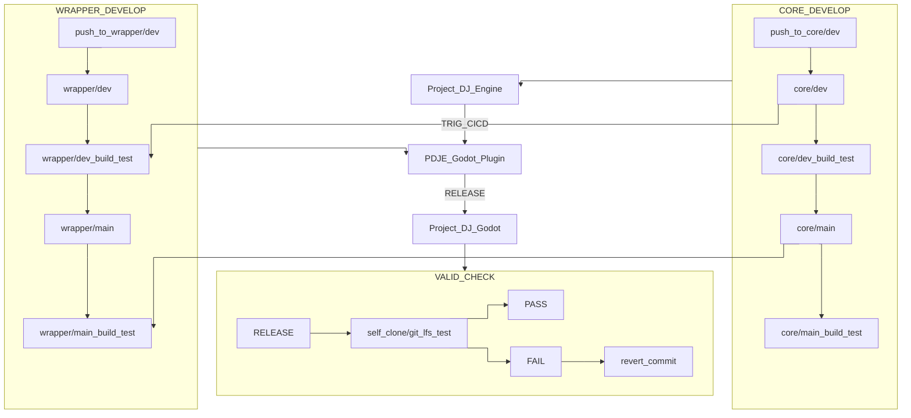

# Project_DJ_Godot

---

---

# 📢 PDJE Input Module — Update Notice (v0.6.X)

## Abstract

The PDJE Input Module has been updated. This module is a **cross-platform, low-level input engine** provided by Project DJ Engine, delivering **best-in-class low latency** suitable for production deployments.
Input data is wrapped through Godot Engine **Signals**, exposing **device GUID**, **user-defined device name**, and **input timestamp (microseconds, µs)** within each signal payload.

---

## What Can We Do

* **Multi-device identification & separation**: Designed to distinguish input sources so that the **same key code** from **different keyboards** is handled independently.
* **High-resolution timestamps**: Uses OS-specific high-resolution timers to provide **µs-level** timestamps.
* **Flexible mapping**:

  * Example: Map **Keyboard A** to lane 1 and **Keyboard B** to lane 2.
  * Example: Connect **multiple mouse** simultaneously and assign **separate cursors** to each.
* **Godot Signal integration**: On each input event, a Signal is emitted with payload fields such as:

  * `device_id` (device unique identifier)
  * `device_name` (registered name)
  * `t_us` (event timestamp, µs)
  * `event_type`, `code`, `value` (implementation details)

> *Note:* Actual signal names/fields may vary by project configuration. Refer to the module’s API docs.

---

## Architecture Overview (Collision-Avoidance Design)

To avoid conflicts with Godot’s built-in input system, the Input Module spawns a **dedicated subprocess**.

* Input buffers are shared via **IPC shared memory**, achieving **low overhead** and **stable latency**.
* **Data path (Godot ⇄ subprocess):**

  1. **Init phase:** exchange configuration over **localhost HTTP** (port, device list, etc.)
  2. **Runtime phase:** deliver event stream via **IPC shared memory**

---

## Initialization (Configure) Phase

* The Godot process scans for an **available port** and passes it as an **argument** when launching the subprocess.
* The subprocess listens on that port to accept the **HTTP configure** request, then exchanges **IPC details** (handles/keys/sizes, etc.).

### Port Preemption (Race Condition) Notice

* Rarely, a third-party process might claim the same port **during** subprocess startup.
* If that happens, the subprocess cannot bind and **exits immediately**.
* While **theoretical and very unlikely**, please **open an issue** with logs and reproduction steps if you suspect this occurred.

---

## Current Support / Version

* **PDJE Version:** `0.6.X`
* **Supported OS:** **Windows** (current)
* **Windows Backend:** **RawInput**
* **Linux (planned):** `libevdev + epoll + RT scheduling`
* **macOS (under review):** `IOKit (tentative)`

---

## Known Issues / Recommendations

* **Port collisions:** Very rare during initialization; if repeated, report with logs.
* **Security/AV tools:** Some environments may restrict RawInput or subprocess creation. Whitelisting/exceptions may be required.
* **Timebase alignment:** For µs-level judgments, follow the documentation’s **timebase synchronization** strategy with your audio/judging engine.

---

## Feedback & Contributions

Bug reports, performance logs (timestamp/latency distributions), and device compatibility feedback are welcome.
When filing an issue, please include: **OS/version**, **PDJE version (0.6.X)**, **Godot version**, **device model**, **repro steps**, and **relevant logs**.

> If you’d like, we can append **Changelog**, **performance metrics**, and **migration guidance** sections tailored to this release.


---


---
**🔍 How To Use**

```bash
git clone https://github.com/Rliop913/Project_DJ_Godot.git
cd Project_DJ_Godot
cp Update_Project_DJ_Godot.bat ~/path/to/your/project/root
cp Update_Project_DJ_Godot.sh ~/path/to/your/project/root

cd  ~/path/to/your/project/root

bash ./Update_Project_DJ_Godot.sh


```

---


📦 **CI/CD Prebuilt Repository**  
This repository receives and stores prebuilt artifacts from [PDJE_Godot_Plugin](https://github.com/Rliop913/PDJE-Godot-Plugin) via automated GitHub Actions.

---


## 🔗 Related Projects
- 🪄 **Godot Wrapper**: [PDJE-Godot-Plugin](https://github.com/Rliop913/PDJE-Godot-Plugin)

- 🧱 **Core Library**: [Project-DJ-Engine](https://github.com/Rliop913/Project-DJ-Engine)

- 📚 **Documentation**: [PDJE DOCS](https://rliop913.github.io/Project-DJ-Engine)

- 🤖 **Codebase Assistant**: [AskToPDJE](https://github.com/Rliop913/AskToPDJE)

- 💻 **Discord**: [Official Discord](https://discord.gg/2Pwju7xhmS)

---

## 🔁 CI/CD Call Graph




This is the CI/CD call graph for this project.
These three repositories are chained into one continuous automation flow using GitHub Actions.
